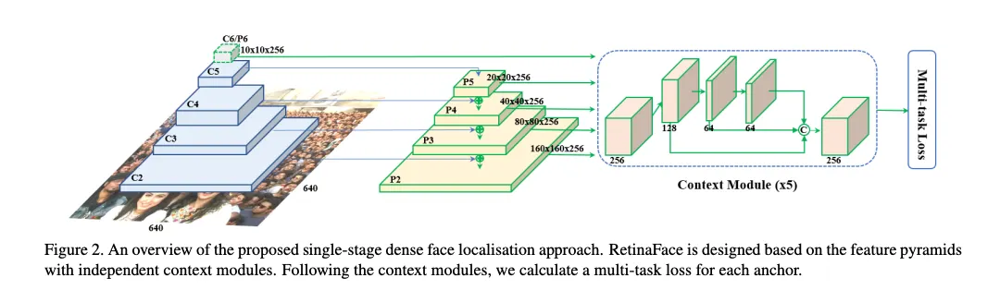

created virtual env, will have to activate it every time
22-02
 1.extracted frames from few videos. tqdm is for the progress bar in terminal 
 2.The processVideos.py file acts as the controller, it scans the real and fake video directories, loops through all videos, and calls extractFrames() for each one.
 3.yolo little bt it gave, initially it detects object it is pretrtained on, like for frame 0 in image 000 it detected whole body, phone and all, gotta write face detection code specifically.
 4. yolo not working properly switching to retinaFace.
 --architecture for retinaface- used resnet50 as its backbone.
 
